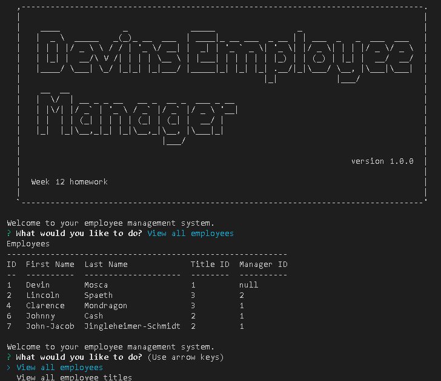

# Employee-Manager
Week 12 homework

## Description 

This homeworks goal is to create a command line application for a business owner to manage their workforce using Node.js, Inquirer, and MySQL. 

## User Story

```md
AS A business owner
I WANT to be able to view and manage the departments, roles, and employees in my company
SO THAT I can organize and plan my business
```

## Acceptance Criteria

```md
GIVEN a command-line application that accepts user input
WHEN I start the application
THEN I am presented with the following options: view all departments, view all roles, view all employees, add a department, add a role, add an employee, and update an employee role
WHEN I choose to view all departments
THEN I am presented with a formatted table showing department names and department ids
WHEN I choose to view all roles
THEN I am presented with the job title, role id, the department that role belongs to, and the salary for that role
WHEN I choose to view all employees
THEN I am presented with a formatted table showing employee data, including employee ids, first names, last names, job titles, departments, salaries, and managers that the employees report to
WHEN I choose to add a department
THEN I am prompted to enter the name of the department and that department is added to the database
WHEN I choose to add a role
THEN I am prompted to enter the name, salary, and department for the role and that role is added to the database
WHEN I choose to add an employee
THEN I am prompted to enter the employee’s first name, last name, role, and manager, and that employee is added to the database
WHEN I choose to update an employee role
THEN I am prompted to select an employee to update and their new role and this information is updated in the database 
```

## Access to REPO and DEMO video

[Repo Link](https://github.com/DMosca2021/dm_Employee-Manager)

[Link to Demo Video]()

## Screenshots



## Credits

- [W3schools SQL joins](https://www.w3schools.com/sql/sql_join_left.asp)
- [Docs on console.table](https://drive.google.com/file/d/1NsxO6yg06DyfL1_r6ak7ZVYkb6q54eKb/view)
- [Google](https://www.google.com/)
